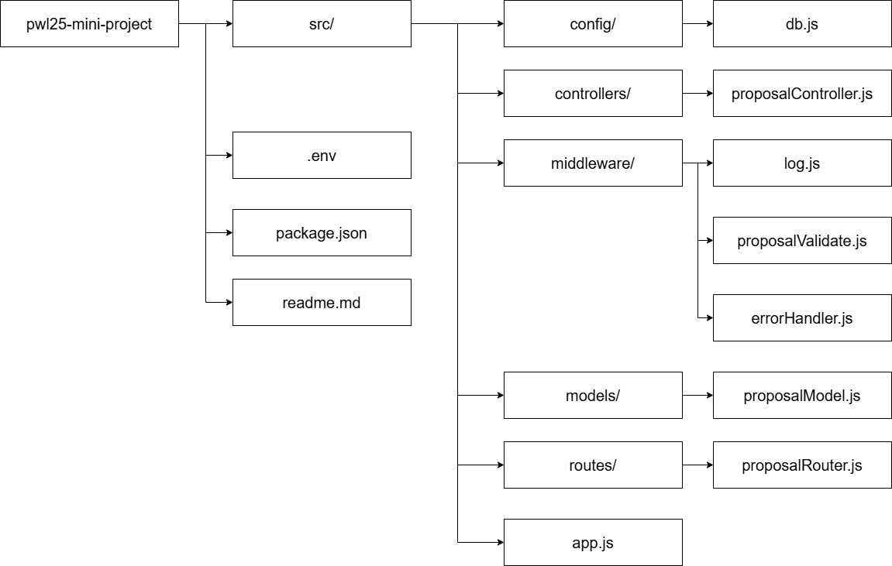

# Mini Proyek UTS - REST API Pengelola Data PKM
## Ajeng Sakinah Wulandari (F1D022001)

Ini adalah mini proyek untuk Ujian Tengah Semester (UTS) mata kuliah Pemrograman Web Lanjut.

Proyek ini adalah sebuah REST API sederhana untuk mengelola data proposal Program Kreativitas Mahasiswa (PKM). API ini dibangun menggunakan **Express.js** dan **MySQL**, dengan menerapkan arsitektur **MVC (Model-View-Controller)**, **Middleware**, dan manajemen konfigurasi menggunakan file `.env`.

## Struktur Proyek

Proyek ini menggunakan struktur folder MVC dan Middleware agar kode tetap rapi dan terorganisir:

1. **`src/config`**: Berisi file `db.js` untuk konfigurasi dan koneksi ke database MySQL.
2. **`src/models`**: Berisi file `proposalModel.js` yang bertanggung jawab untuk semua logika query SQL (CRUD) ke database.
3. **`src/controllers`**: Berisi file `proposalController.js` yang bertindak sebagai logika aplikasi. Ini menangani logika bisnis, menerima request dari routes dan memanggil fungsi yang sesuai dari file di models.
4. **`src/routes`**: Berisi file `proposalRouter.js` yang mendefinisikan semua alamat URL (endpoint) yang dipahami oleh API (misalnya `GET /proposals`, `POST /proposals`, dll).
5. **`src/middleware`**:
    * `log.js`: Mencatat setiap request yang masuk ke konsol.
    * `proposalValidate.js`: Memvalidasi data request body (JSON) sebelum diproses oleh controller.
    * `errorHandler.js`: Menangani error 404 (Not Found) dan 500 (Internal Server Error) secara terpusat.
6. **`.env`**: File untuk menyimpan semua data rahasia (konfigurasi database, port) agar terpisah dari kode utama.
7. **`app.js`**: File utama yang menyatukan semua bagian (middleware, routes) dan menjalankan server Express.

## Hasil Uji Coba POSTMAN

1. Menampilkan semua data dari tabel proposals dengan menggunakan GET pada POSTMAN

2. Gagal menampilkan semua data dari tabel karena url tidak sesuai dengan yang diatur pada kode

3. Menambahkan data baru dengan menggunakan POST pada POSTMAN dan menambahkan sesuai dengan kolom-kolom pada tabel proposals

4. Memperbarui data proposal dengan PUT pada POSTMAN dengan mengambil ID proposal dan melakukan perubahan atau pembaruan terhadap data proposal tersebut

5. Menghapus data proposal dengan DELETE di POSTMAN dan mengambil ID proposal tertentu yang ingin dihapus

## Struktur Folder Project
